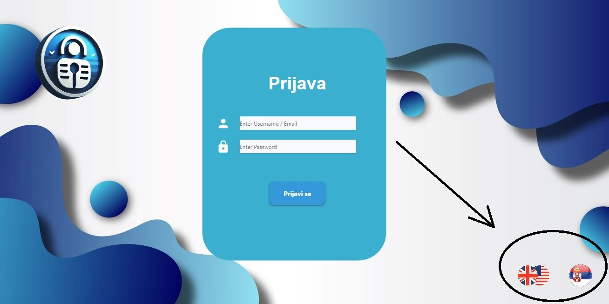
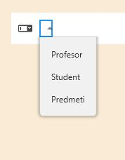
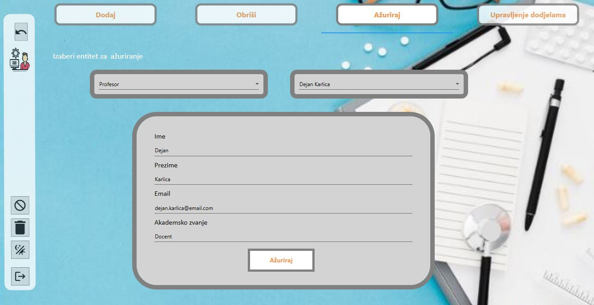

# Sistem za praćenje studentskih aktivnosti

## Svrha dokumenta

Svrha ovog dokumenta je da pruži detaljan pregled glavnih funkcionalnosti i da korisnicima omogući uvid u korišćenje aplikacije. U dokumentu su prikazane sve osnovne funkcionalnosti kroz slike i tekst.

## O aplikaciji

Aplikacija ima zadatak da pokrije osnovne potrebe studenata i profesora u vezi njihove interkacije i neophodne razmjene podataka. Omogućava jednostavan uvid studentima u obaveze, postignute rezultate i dostignuća, a profesorima lako zadavanje svih neophodnih zadataka i indirektne komunikacije sa studentima.

## Korisnički nalozi

 Aplikacija podrzava rad sa tri tipa korisnika:
 1. administrator
 2. student
 3. profesor

## Funkcionalnosti

| **Tip korisnika**       | **Funkcionalnosti**                                                                                                                                                            |
|--------------------------|-------------------------------------------------------------------------------------------------------------------------------------------------------------------------------|
| **Superadministrator**   |  Dodavanje i brisanje profesora: Superadministrator može dodavati nove profesore sa osnovnim podacima i dodeljivati im predmete.                                              |
|                          |  Dodavanje i brisanje studenata: Superadministrator može dodavati nove studente, unositi njihove osnovne podatke.                              |
|                          |  Kreiranje i ažuriranje predmeta: Superadministrator može kreirati nove predmete sa osnovnim informacijama i dodjeljivati ih profesorima.                                    |
|                          |  Dodjela prava pristupa: Superadministrator dodjeljuje profesorima administratorska prava za predmete koje predaju, čime ograničava njihov pristup na relevantne podatke.    |
|  **Profesor**            |  Dodavanje domaćih zadataka i ispita: Profesor može dodati domaće zadatke i ispite za svoje predmete, uključujući rokove i maksimalne bodove.                                |
|                          |  Vođenje evidencije o prisustvu: Profesor može uneti prisustvo za svakog studenta na predmetu, uključujući datume.                                       |
|                          |  Unos i pregled ocjena: Profesor može dodavati ocjene za ispite za studente na svojim predmetima. Može da pregleda sve ocjene studenata na predmetima koje predaje za studente koje slušaju predmete.                                                                   |
|                          |  Pregled rezultata studenata: Profesor može pregledati ukupne rezultate po studentu za svoje predmete, uključujući prisustvo, bodove iz zadataka i ocjene sa ispita.        |
| **Student**              |  Pregled prisustva: Student može pregledati svoje prisustvo po predmetu, uz detalje o svakom času.                                                                           |
|                          |  Pregled domaćih zadataka i ispita: Student može pregledati domaće zadatke za svaki predmet, uključujući rokove i rezultate (bodove ili ocene).                      |
|                          |  Pregled ukupnog uspjeha: Student može vidjeti svoj ukupan uspjeh po predmetu kroz zbir bodova i ocjena koje je dobio.                                                       |
| **Svi korisnici**        |  Internacionalizacija: Sistem omogućava korisnicima da biraju između više jezika.                                                                                           |
|                          |  Podešavanje tema: Korisnici mogu birati između svetle i tamne teme, koja se automatski čuva za svakog korisnika.                                                           |
|                          |                                                                  |

## Korisničko upustvo

### Prijava u aplikaciju

Za pristupanje aplikaciji  neophodno je da se korisnici prvo autentifikuju na sam sistem
tj. da se prijave. Za prijavu korisnici koriste odgovarajuće kredencijale u obliku korisničkog
imena i lozinke. Pristupne kredencijale dobijaju od administratora/menadžera, koji je zadužen
za kreiranje naloga. Korisnici moraju da pamte svoje kredencijale.

Prilikom otvaranja aplikacije korisniku se pojavljuje početni ekran u kojem unosi svoje korisničko ime i svoju lozinku. Kada korisnik unese kredencijale, pritisne dugme Prijava/LogIn. S obzirom da postoje tri tipa korisničkih naloga (student, profesor, administrator), 
prvo se provjerava da li su korisničko ime i lozinka validni. Ako su validni, otvara se odgovarajući prozor u zavisnosti od tipa korisničkog naloga. Prozori će korisnicima omogućiti neophodne interakcije.

Ako su korisničko ime ili lozinka pogrešni, ispisaće se povratni prozor koji će obavijestiti korisnika da postoji greška pri unosu korisničkog imena ili lozinke.

### Izbor jezika aplikacije

Aplikacija omogućava korisnicima da na početnom ekranu odaberu željeni jezik između **srpskog** i **engleskog**, čime se prilagođava korisničko iskustvo.

#### Postupak odabira jezika:

1. **Prikaz opcija jezika:**
   - Na početnom ekranu se nalaze dva dugmeta za izbor jezika, prikazana zastavicama:
     - **🇷🇸 Srpska zastava** za srpski jezik.
     - **🇬🇧/🇺🇸 Britanska/Američka zastava** za engleski jezik.

2. **Radnje korisnika:**
   - **Klikom na dugme sa srpskom zastavom (🇷🇸):**
     - Aplikacija prelazi na **srpski jezik**.
     - Sve komande, tekstovi i opcije u aplikaciji prikazuju se na srpskom jeziku.
   - **Klikom na dugme sa britanskom ili američkom zastavom (🇬🇧/🇺🇸):**
     - Aplikacija prelazi na **engleski jezik**.
     - Sve komande, tekstovi i opcije u aplikaciji prikazuju se na engleskom jeziku.

#### Pozicija dugmadi:

Dugmad za izbor jezika nalaze se u **donjem desnom uglu početnog ekrana**, omogućavajući jednostavan i intuitivan odabir jezika.

 

## Promjena teme

Kada se korisnik uspješno prijavi, otvoriće mu se odgovarajući prozor, u zavisnosti tipa korisnika. Prijavljeni korisnik će sa lijeve strane imati MenuBar.
Svaki korisnik moze da promijeni temu, tako što se u MenuBar, sa lijeve strane, desnim klikom pritisne na ikonicu za promijenu teme.

Otvori će se meni sa temama, tako da korisnik može da izabere između plave, crvene ili zelene teme. Kod svih korisnika, osim administratora, kada izaberu temu pamtiće se izbor tema, tako da prilikom sljedeće prijave aplikacija se pokreće sa posljednjim sačuvanim  izborom teme.
Kod administratora podrazumijevana tema je plava.
Teme se razlikuju po pozadini, fontu slova, boji slova, dizajnu dugmadi.
Primjer izgleda dvije teme za interfejs profesora (crvene i zelene), dok će se treća tema (plava) koristiti u ovom dokumentu.

  
  

## Funkcionalnosti administratora

Administrator aplikacije ima mogućnost upravljanja entitetima ( dodavanje, brisanje, ažuriranje studenata, profesora, predmeta) i dodjele zaduženja profesorima na predmetima, kao i pristup raznim opcijama putem interfejsa.

Kada se administrator unosom kredencijala prijavi, otvara se administratorski prozor.

### Glavne funkcionalnosti:

1. **Dodavanje, ažuriranje i brisanje entiteta:**
   - Administrator može kreirati nove entitete (npr. studente, profesore, predmete).
   - Može ažurirati postojeće podatke o entitetima.
   - Može obrisati entitete iz sistema.
   - Može da profesore zadužuje/razdužuje na predmetima

2. **MenuBar sa dodatnim opcijama:**
   - **Undo:** Poništava prethodnu akciju.
   - **Cancel dugme:** Omogućava čišćenje svih unesenih podataka u aplikaciji.
   - **Delete ikonica:** Koristi se za brisanje studenata iz sistema.
   - **Ikonica za promjenu pozadine:** Omogućava promjenu vizuelnog izgleda aplikacije.
   - **Logout ikonica:** Koristi se za odjavu administratora iz aplikacije.

- MenuBar se nalazi na **lijevoj strani aplikacije**, omogućavajući brz i intuitivan pristup opcijama.
- Sve akcije su jasno označene i vizualno predstavljene putem ikonica, čime se olakšava rad administratora.

### Dodavanje studenata, profesora, predmeta

 Administrator ukoliko želi da doda ili studenta ili profesora ili predmet, mora da izabere karticu **"Dodaj" **. Kada izabere karticu dodaj, može da bira koji entitet želi da doda. Ukoliko želi da doda profesora, treba da izabere **Profesor**, studenta **Student**, predmet **Predmet**. 

  

U zavisnosti od izabranog entiteta, otvara se forma za unos podataka. Ako administrator selektuje **Profesor**, dobija formu za kreiranje naloga za profesora. Pretpostavlja se da administrator zna osnovne podatke profesora, pa ih unosi, ali  kreira i kredencijale koje će profesor kasnije koristiti za logovanje.

  

 Prilikom unosa, ukoliko želi da prekine unos i izbriše sve unijeti podatke u polja može da pritisne dugme za **"Cancel"**, te na taj način da očite polja.
 Na isti način, koristeći **"Cancel**, može da očisti i polja za **Studenta** i **Predmet**.

Dodavanje **Studenta** i **Predmeta** će imati svoje forme.

  
  

Sva polja prilikom dodavanja moraju biti popunjena, u suprotnom će korisnik dobiti povratnu informaciju da postoje prazna polja.

### Brisanje studenata, profesora, predmeta

Ukoliko administrator želi da obriše entitet kao što su student, profesor ili predmet, potrebno je da odabere karticu "Obriši". U okviru ove kartice nalazi se ComBox u kojem administrator može izabrati tip entiteta koji želi da obriše (Predmet, Student, Profesor).

Nakon što administrator izabere odgovarajući entitet, na ekranu će se prikazati svi entiteti tog tipa. Administrator zatim može selektovati specifičan entitet koji želi da obriše, a potom u MenuBar-u pritisnuti ikonu za "Brisanje".

 

Na primer, ako administrator izabere "Profesor", prikazaće se lista svih profesora. Administrator može da selektuje profesora kojeg želi da obriše, nakon čega treba da pritisne ikonu "Delete".

### Ažuriranje

Ukoliko administrator želi da ažurira neki entitet (studenta, profesora, predmet), mora da izabere tab za **"Ažuriranje"**.
Nakon toga, prikazuje se okruženje za ažuriranje.

Postoje dva ComBox. U prvom ComBox  se bira koji entitet želi da ažurira.

 Nakon što izabere entitet koji želi da ažurira, prikazuje se forma sa poljima za ažuriranje.

 Administrator treba da izabere konkretan entitet koji želi da ažurira. Nakon što selektuje entitet kojeg želi da ažurira, popunjava se forma za ažuriranje podacima 
izabranog entiteta.

U formi se podaci mogu izmijeniti. Svi podaci se mogu izmijeniti. Kada se pritisne na dugme "Ažuriraj", podaci se ažuriraju.

### Upravljanje Dodjelama

Funkcionalnost za **Upravljanje dodjelama** uključuje dvije kartice: **"Dodijeli kurs"** i **"Razduži"**.

#### Dodijeli Kurs

Kartica **"Dodijeli kurs"** omogućava administratoru da dodeli predmet profesoru. Ova kartica sadrži dva **ComBox**-a:
1. **Prvi ComBox** omogućava odabir profesora kojem će biti dodeljen predmet.
2. **Drugi ComBox** omogućava odabir predmeta koji će biti dodeljen izabranom profesoru.

Nakon što administrator odabere odgovarajuće opcije, klikom na dugme **"Dodijeli kurs"**, profesor se zadužuje za predmet.

#### Razduži

Kartica **"Razduži"** omogućava uklanjanje zaduženja profesora za određeni predmet. Proces uključuje dva **ComBox**-a:

1. **Prvi ComBox** omogućava odabir profesora koji se razdužuje sa predmeta.
2. **Drugi ComBox** omogućava odabir predmeta sa kojeg se profesor razdužuje.

Nakon što su opcije izabrane, klikom na dugme **"Razduži"**, profesor se razdužuje sa predmeta. To znači da profesor više neće imati pristup funkcionalnostima vezanim za predmet, kao što su:

- Pregled studentata koji slušaju predmet
- Dodavanje prisustva
- Dodavanje domaćih zadataka
- Unos ocjena

Samo profesor koji je zadužen za predmet ima mogućnost pristupa ovim funkcijama.

### Opcija Undo i Logout

U MenuBar, na samom vrhu, je ikonica za **Undo**, kojom se poništavaju prethodne akcije.
Na samom dnu MenuBar-a je ikonica za **LogOut**. Kada korisnik dvoklikne na tu ikonicu odjaviće se se.

## Funkcionalnosti profesora

Kada se profesor uspješno prijavi, otvara mu se prozor, tako da u vrhu postoje četiri kartice:
1. **Predmeti**
2. **Domaći i Ispiti**
3. **Prisustvo**
4. **Ocjene**

### Predmeti

U tabu **"Predmeti"** prikazani su predmeti koje profesor predaje. Kada selektuje neki predmet i dugme "Student",prikazuju  se studenti koji slušaju predmet.

Studenti koji slušaju predmet se prikazuju u posebnom prozoru.

### Domaći zadaci

Profesor u tabu **Domaći zadaci** ima dva podtaba, jedan za dodavanje novog domaćeg zadatka, a drugi za pregled svih domaćih zadataka.

#### Dodavanje domaćeg zadatka

Profesor popunjava sva neophodna polja za domaći zadatak. Sva polja moraju da budu popunjena. Sva polja podržavaju stringove, osim polja **Maksimalan broj bodova**, koji podržava cjelobrojne vrijednosti.
Ukoliko sva polja nisu popunjena, korisnik će dobiti povratnu informaciju.

Profesor može da doda domaći zadatak samo predmetima koje predaje. Isto tako, samo studenti koji slušaju predmete mogu da pregledaju domaće zadatke. 
Kada se ** popune sva polja **, profesor pritiskom na dugme **"Dodaj"** pamti domaći zadatak. 

#### Pregled zadataka

U ovom tabu profesor može da pregleda sve domaće zadatke, iz svih predmeta koje predaje. Može da pregleda osnove informacije o svakom domaćem zadatku.

### Prisustvo

Profesor može da vodi evidenciju o prisustvu studenata koji slušaju njegov predmet. U tabu **Prisustvo**, postoji dva podtaba. Prvi podtab **Unos prisustva** omogućava da se evidentira prisustvo, dok drugi tab 
**Pregled prisustva** omogućava da se pregledaju prisustva.

#### Evidencija Prisustva

Evidencija prisustva obavlja se kroz sledeće korake:

1. **Odabir predmeta**:  
   U lijevom **ComBox**-u nazvanom **Predmeti**, profesor odabire predmet za koji želi da evidentira prisustvo.  
   Ovaj **ComBox** je automatski popunjen predmetima koje predaje profesor.  
   Nakon izbora predmeta, u tabeli će se prikazati svi studenti koji pohađaju odabrani predmet.

2. **Odabir datuma**:  
   U desnom **ComBox**-u nazvanom **Datum**, profesor bira datum za koji želi da evidentira prisustvo.

3. **Evidentiranje prisustva**:  
   Tabela sadrži kolonu pod nazivom **Prisustvo**, u kojoj se nalaze **Checkbox** polja za svaki red (studenta).  
   Profesor može označiti prisustvo za svakog studenta pojedinačno klikom na odgovarajući **Checkbox**.

4. **Čuvanje evidencije**:  
   Nakon što je prisustvo svih studenata evidentirano, profesor pritisne dugme **"Sačuvaj"**, čime se podaci o prisustvu memorišu.

### Napomena:
- Lista predmeta i studenata dinamički se generiše na osnovu trenutnih podataka o zaduženjima profesora i upisima studenata.
- Evidencija se trajno čuva kako bi se omogućio uvid i dalja obrada podataka.

### Pregled Prisustva

Funkcionalnost **Pregleda prisustva** omogućava profesorima ili administratorima da prate informacije o prisustvu studenata na odabranim predmetima. Proces pregleda prisustva se odvija na sljedeći način:

1. **Izbor studenta**  
   - U lijevom **ComBox-u** pod nazivom **"Student"**, potrebno je odabrati studenta za kojeg se želi pregledati prisustvo.  
   
2. **Izbor predmeta**  
   - U desnom **ComBox-u** pod nazivom **"Predmeti"**, bira se predmet na kojem se traži prisustvo odabranog studenta.  

3. **Prikaz informacija o prisustvu**  
   - Nakon selekcije studenta i predmeta, tabela ispod se popunjava informacijama o prisustvu studenta za taj predmet.  
   - Ukoliko za odabranog studenta na selektovanom predmetu ne postoji evidentirano prisustvo, prikazuje se obaveštenje: **"Nema evidentiranog prisustva za izabranog studenta na selektovanom predmetu."**

Ova funkcionalnost pruža brz i jasan uvid u evidenciju prisustva studenata na odabranim predmetima.

### Ocjene

Profesori imaju mogućnost  unos ocjena i pregleda ocjena studenata na predmetima na kojima je zadužen.

#### Unos ocjena

Funkcionalnost unosa ocjena dostupna je u tabu **"Ocjene"** i realizuje se na sledeći način:

1. **Izbor predmeta**  
   - Profesor bira predmet na kojem je organizovan ispit. Moguće je izabrati samo predmete na kojima profesor ima zaduženje.

2. **Izbor datuma ispita**  
   - Nakon izbora predmeta, bira se datum održavanja ispita.

3. **Izbor studenta**  
   - Profesor odabire studenta kojem unosi ocjenu. Prikazuju se samo studenti koji slušaju odabrani predmet.

4. **Unos bodova i ocjene**  
   - Profesor unosi broj bodova i ocjenu.  
   - **Napomena**: Ocjena mora biti cjelobrojna vrijednost. Ukoliko se pokuša unositi tekstualna vrijednost, aplikacija generiše grešku.

5. **Validacija podataka**  
   - Sva polja (predmet, datum, student, bodovi i ocjena) moraju biti popunjena. Ukoliko neko polje nije popunjeno, profesor dobija obavještenje da su sva polja obavezna.

  

6. **Čuvanje podataka**  
   - Klikom na dugme **"Sačuvaj"**, profesor memoriše unesene vrijednosti.  
   - Nakon uspješnog čuvanja, forma se automatski prazni, omogućavajući novi unos podataka.

  

Ova funkcionalnost omogućava profesorima da na jednostavan način evidentiraju ocjene studenata i osiguravaju tačnost unesenih podataka.

#### Pregled ocjena

**Opis funkcionalnosti:**

Pregled ocjena omogućava profesoru da na jednostavan način pristupi ocjenama svojih studenata. Funkcionalnost se sastoji od sledećih elemenata:

1. **Selekcija studenta**:
   - Profesor može odabrati studenta sa liste pomoću **lijevog combo-box-a**. Lista studenata prikazuje sve studente koji su povezani sa predmetima koje profesor predaje.

2. **Selekcija predmeta**:
   - Nakon što odabere studenta, profesor koristi **desni combo-box** za selektovanje predmeta na kojem predaje. Lista predmeta sadrži samo one predmete na kojima je profesor upisan kao nastavnik.

3. **Prikaz ocjena**:
   - U tabeli ispod combo-box-ova, biće prikazani sledeći podaci za odabranog studenta:
     - **Ime i prezime studenta**
     - **Ocjena** koju je student postigao na predmetu
     - **Datum ispita** kada je ocjena uneta

**Korisnički interfejs**:

- **Lijevi combo-box**: Sadrži listu studenata.
- **Desni combo-box**: Sadrži listu predmeta koje profesor predaje.
- **Tabela**: Prikazuje ime i prezime studenta, ocjenu i datum ispita.

**Napomena**: Ova funkcionalnost omogućava profesorima da brzo i efikasno pregledaju ocjene svojih studenata za specifične predmete. Sve promjene u selektovanim studentima i predmetima odmah se odražavaju u tabeli, pružajući tako interaktivan i pregledan način za praćenje ocjena.

### Opcija Undo i Logout

U MenuBar, na samom vrhu, je ikonica za **Undo**, kojom se poništavaju prethodne akcije.
Na samom dnu MenuBar-a je ikonica za **LogOut**. Kada korisnik dvoklikne na tu ikonicu odjaviće se se.

## Funkcionalnosti studenta

### Pregled prisustva, domaćih zadataka i ispita

Student ima mogućnost pregleda informacija o prisustvu, domaćim zadacima i ispitima na predmetima za koje je zadužen. Ove informacije su organizovane u tri taba radi bolje preglednosti i funkcionalnosti.

####  Pregled Prisustva
U tabu **Pregled Prisustva**, student može pregledati evidenciju svojih prisustava na predavanjima:
- U padajućem meniju (**Lista predmeta**) student bira predmet za koji želi da pregleda evidenciju prisustva.
- Nakon odabira predmeta, u tabeli će se prikazati:
  - **Datumi predavanja**.
  - **Informacija** o tome da li je student prisustvovao tim predavanjima.
  - 

  

####  Domaći zadaci
- Ovaj tab omogućava studentu da pregleda zadatke koji su mu dodijeljeni.  U padajućem meniju, student može da izabere predmet za koje hoće da pregleda domaće zadatke.
- Prikazuju se:
  - Naziv zadatka (kolona Ime)
  - Rokovi za predaju (kolona Rok)
  - Opis(kolona Opis).

  

####  Ispiti
- U tabu **Ispiti**, student ima uvid u informacije o organizovanim ispitima na izabranim predmetima.
 Student prvo selektuje predmet za koji želi da vidi ocjene i bodove. U padajućem meniju (ComBox) prikazuju se samo predmeti koje sluša.
  Ukoliko nema evidentiranih informacija u vezi ispita, student će dobiti povratnu informaciju.
- Student može pregledati:
  1. **Datum ispita**.
  2. **Broj osvojenih bodova**.
  3. **Krajnju ocjenu** iz predmeta.

  

### Opcija Undo i Logout

U MenuBar, na samom vrhu, je ikonica za **Undo**, kojom se poništavaju prethodne akcije.
Na samom dnu MenuBar-a je ikonica za **LogOut**. Kada korisnik dvoklikne na tu ikonicu odjaviće se se.

